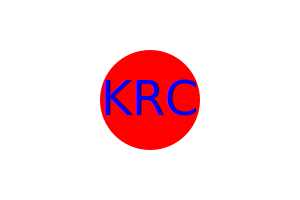

# C10-SVG-KC

  

  ## Description
  This SVG Logo Maker application dynamically generates a simple logo for anyone to use as an svg file. You can customize up to three letters for your logo, three different shapes (circle, square, triangle), and the color of your shape and text. This eliminates the need to pay someone to build a logo for you. My motivation for building this application was to build something that demonstrates my ability to build back end applications through node using inquirer and jest. 

  ## Table of Contents
  * [Installation](#installation)

  * [Usage](#usage)

  * [License](#license)

  * [Contributing](#contributing)

  * [Tests](#tests)

  * [Questions](#questions)

  * [Credits](#credits)

  ## Installation
  * Clone the repository onto your local machine. 
  * Open an integrated terminal.
  * Run the following command to install dependencies: `npm i`
  
  ## Usage
  Once you clone the repo and install the dependencies you, enter `npm start` and you will be given a series of prompts to answer. Simply respond to each question in the terminal.  Once you have answered all prompts a logo.svg file will be in the lib folder. You will then be able to copy the file into any of your projects or files that you would like. 

  

  Video Demonstration Link: https://drive.google.com/file/d/1ySvrTbsgE4LLgk1mLfRgU_j7As6jqxny/view
  
  
  ## License
  Notice: This application is covered under the  license.

  ## Contributing
  At this time there are no plans to include contributions to this project. 

  ## Tests
  To run tests, open the integrated terminal and run the following command: `npm test`.
  
  ## Questions
  Please reach out to me below if you have any questions.

  
  GitHub: [HotBarbeque](https://github.com/hotbarbeque)

  Email: kyry.curry@gmail.com
  
  ## Credits
  I am the sole collaborator on this project.